<div align="center">

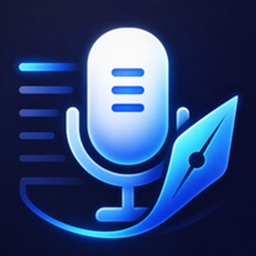

# 🎙️ Scribe

**You talk three times faster than you type. Scribe closes the gap, privately.**

Hold a key, speak, release. Polished text lands at your cursor in any app on Windows 11.
No cloud. No account. No subscription. No audio ever leaves your PC.

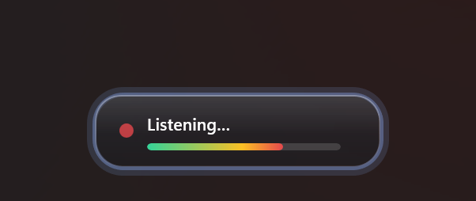

**⚡ ~¼-second response** &nbsp;·&nbsp; **🏎️ transcribes ~30× faster than realtime** &nbsp;·&nbsp; **🔒 100% on-device** &nbsp;·&nbsp; **💸 $0 forever**

</div>

---

Scribe is a lightweight tray app that turns your voice into text anywhere on Windows: your
editor, browser, chat, terminal, notes, email. Dictation apps usually make you choose. The
accurate ones ship your voice to someone else's server and charge monthly for the privilege,
and the private ones type like it's 2009. Scribe refuses the trade: a state-of-the-art speech
model (**NVIDIA Parakeet TDT 0.6b v3**, the same family topping open ASR leaderboards) runs
**entirely on your CPU**, decoding a sentence in the time it takes to lift your finger off the
key. Measured on a desktop CPU: **~223 ms typical decode, real-time factor ~0.03×**.

## ✨ Why people switch

- **🔒 Private by architecture, not by promise.** Audio is captured, transcribed in memory, and
  discarded on your machine. There is no server to trust, because there is no server.
- **⚡ Two keys, your choice.** Hold **Right Ctrl** (or any key), talk, release. Add an optional
  second hotkey when you want dictation that always skips AI cleanup. Prefer hands-free? Toggle
  mode ends the dictation by itself when you stop talking.
- **🌍 Speaks your language.** The bundled model transcribes about 25 European languages out of the
  box, no setup: dictate in English, German, Spanish, French, Italian and more, and it just works.
- **🧠 It understands how people actually talk.** Say *"send it Wednesday… I mean Thursday"* and,
  with AI cleanup on, only Thursday survives. Repeat yourself and it writes the point once.
- **🔢 Numbers, dates and acronyms come out written, not spoken.** "Twenty three licenses at
  three thirty p m on july third" becomes *23 licenses at 3:30 PM on July 3*, the way an editor
  would write it, applied automatically.
- **🎭 Different apps, different voices.** Per-app profiles give Outlook polished prose, Slack a
  casual tone, and your terminal one terse line, automatically, based on where your cursor is.
- **⌨️ Terminal-smart.** Line breaks become spaces in terminals so a long dictation arrives as one
  message instead of firing Enter mid-thought. Built by someone who dictates into CLIs all day.
- **📖 Your vocabulary, your snippets.** A dictionary locks in your jargon (`azure` → `Azure`,
  `dot net` → `.NET`), imports/exports as CSV to share with your team, and even **suggests terms
  from your own dictation history**. Opt-in libraries include a curated Modern Developer Stack for
  names such as Supabase, Cloudflare, Vercel, Next.js and Tailwind CSS. Say a trigger phrase and a
  whole saved template types itself.
- **🧹 AI polish on your terms.** Grammar and structure cleaned by an on-device model (fully
  offline), your Azure deployment, or **any OpenAI-compatible server you already run** (Ollama,
  LM Studio, OpenRouter…). Your models, your keys, your costs. Flip it on or off right from the
  tray.
- **📊 Performance you can verify.** A built-in diagnostics panel computes latency percentiles
  from your own dictations, on your own disk. We don't ask you to take the speed claims on faith.
- **📈 Usage without surveillance.** Track local dictation totals, speech time, active days, top
  apps, a trend chart and recurring terminology, and add uncovered terms to your dictionary with
  one click. AI insight is a separate explicit action and sends only aggregate totals and
  dictionary term labels to the provider you configured.
- **🪶 Stays out of the way.** A tray app with a small glass recording pill you can place on any
  corner or edge of your screen, and a Windows 11-style settings app when you want to tune it.

## 📸 A quick look

### A settings app that respects you
Everything lives in a clean, Windows 11-style settings window: pick your microphone, speech model,
and push-to-talk keys (hold or toggle), then browse focused sections for dictation behaviour, the
overlay, AI cleanup, your dictionary, snippets, per-app profiles, the playground, history, usage
and diagnostics.

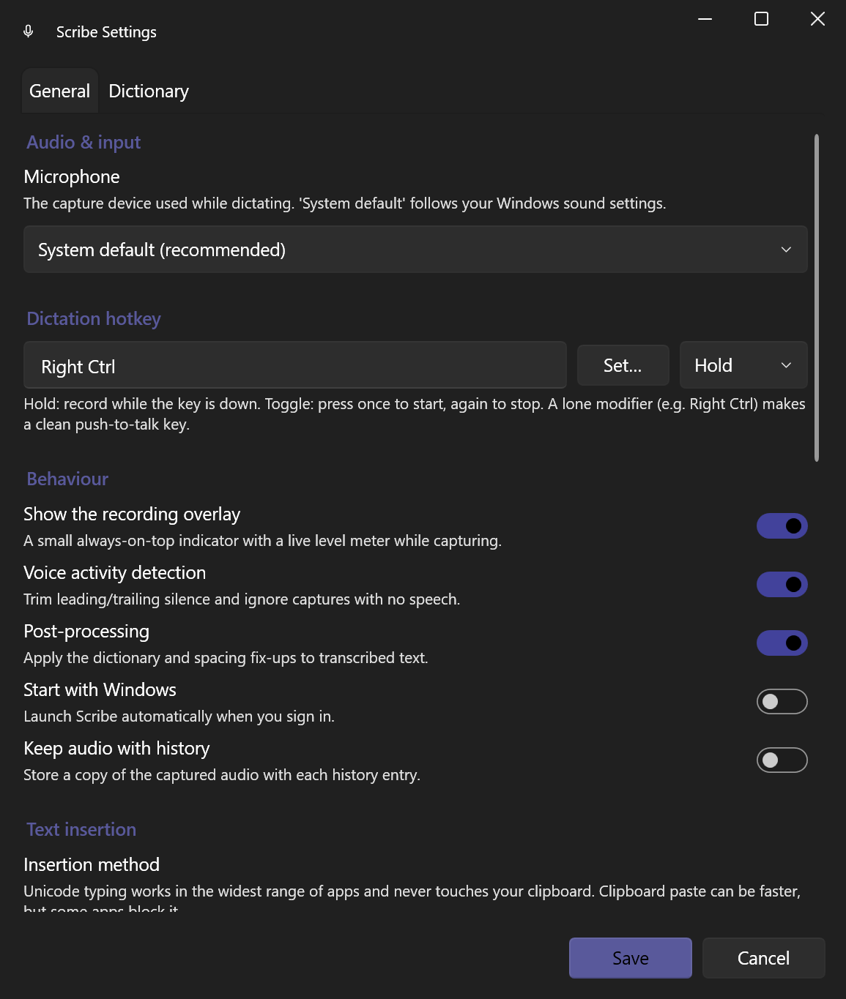

### Put the pill exactly where you want it
Click a spot on the mini screen and **preview the real pill** at that position before you save.
Optional silence auto-stop ends a toggle dictation when you go quiet.

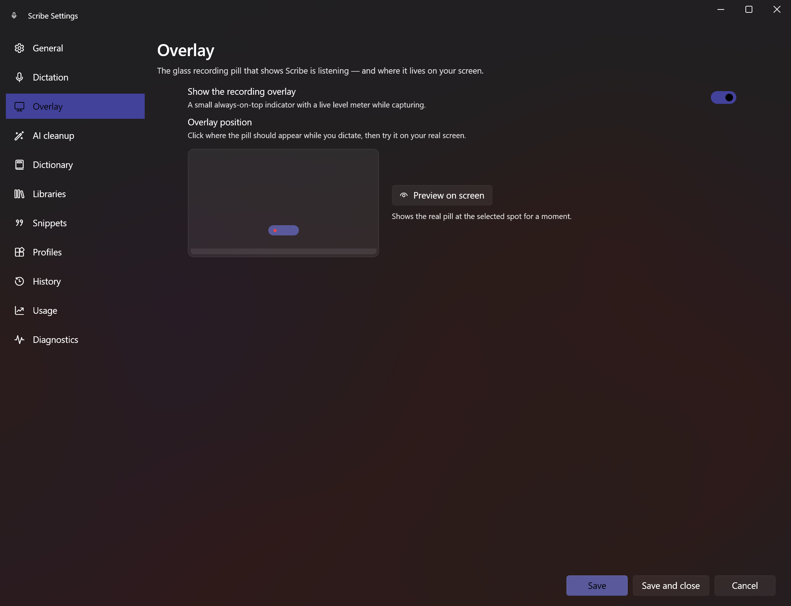

### Say a phrase, type a template
Voice snippets expand a spoken trigger, like *"insert my standup update"*, into a saved,
multi-line template. Text-expander speed, no keyboard required.

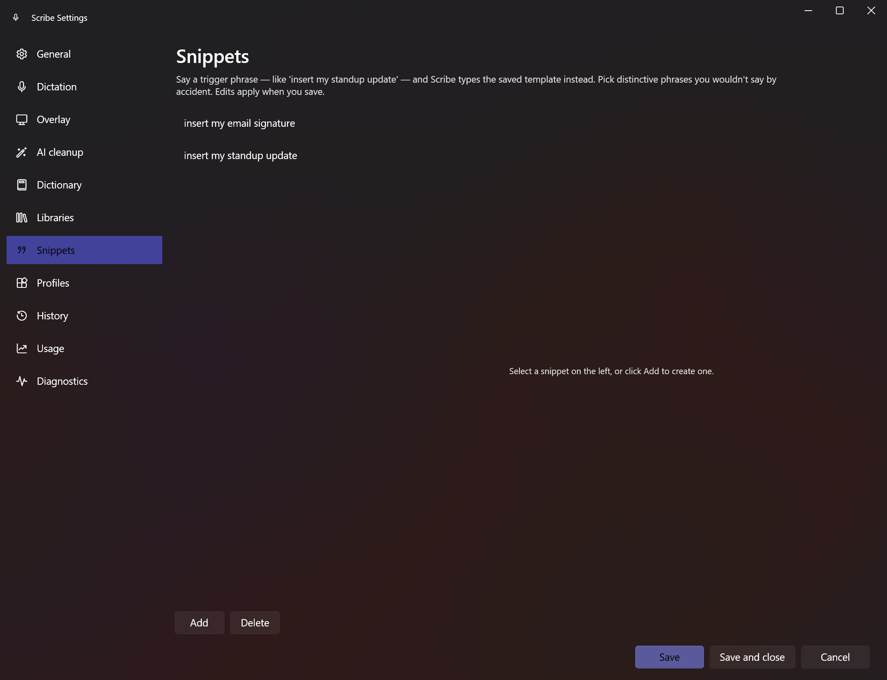

### One voice, many registers
Profiles adapt dictation to the app you're speaking into: the AI writing style and line-break
behaviour switch automatically based on the focused window. First matching profile wins; everything
else uses your global settings.

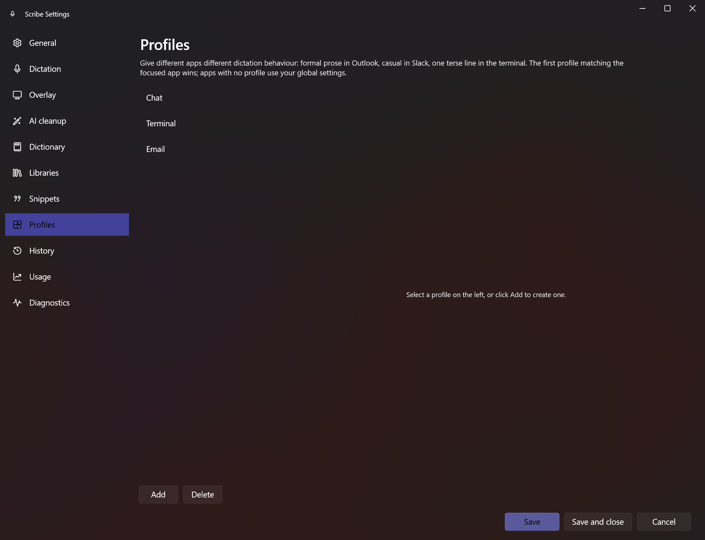

### Polish your words with AI, on your PC
Turn on **AI cleanup** to have a language model fix punctuation, capitalization, sentence structure,
spoken self-corrections and repeated points *before* the text is inserted. The default provider runs
**fully offline** through [Foundry Local](https://learn.microsoft.com/azure/ai-foundry/foundry-local/).
If the model isn't ready, dictation just continues with the raw transcript.

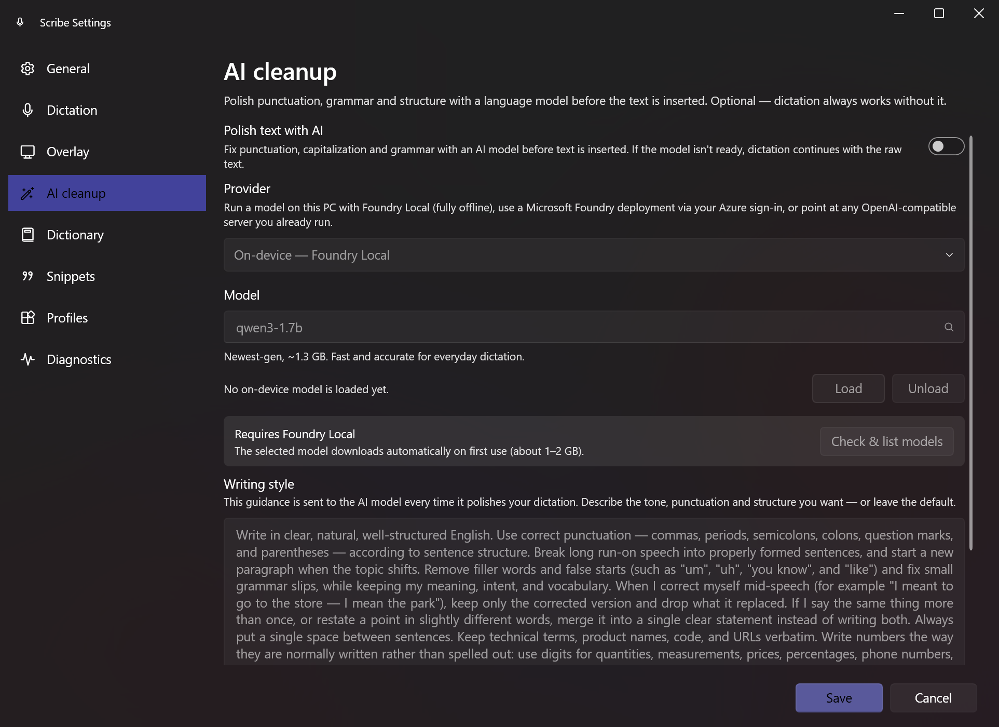

### …or bring your own model
Point Scribe at a model you've already deployed in **Microsoft Foundry**: it signs in with your
existing `az login`, discovers your deployments, and lists them in a **browsable dropdown** (type
to filter) so you pick a model instead of remembering deployment names. Or aim it at **any
OpenAI-compatible endpoint**: Ollama or LM Studio on localhost, vLLM on your homelab, OpenRouter,
or api.openai.com with your own key. Only the transcribed *text* is ever sent (never audio), and
only to the endpoint **you** configure. And when you want the raw transcript, **toggle AI cleanup
straight from the tray menu** with no settings trip required.

### Teach it your words
The dictionary replaces spoken words and phrases with the spelling you actually want, and feeds the
AI cleanup a glossary of your preferred vocabulary. Build it in seconds: **import a CSV** your team
shares, grab the self-documenting **template**, or let **Learn from history** spot the acronyms
and product names you keep saying and add them for you.

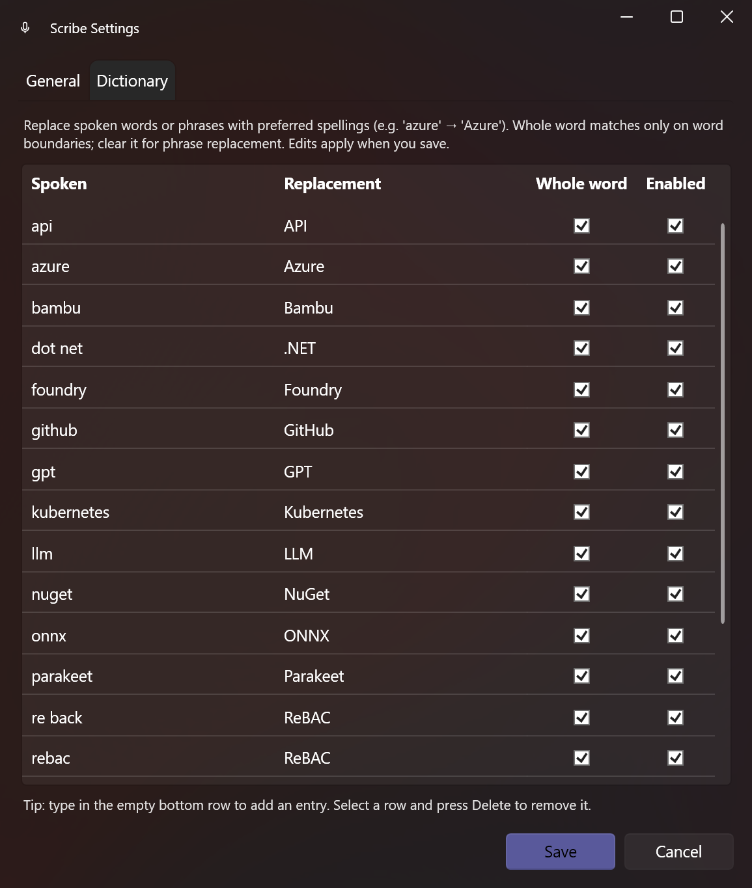

### Know exactly how fast it is
The Diagnostics section computes latency percentiles from your own dictation history. Nothing is
collected; it's your data on your disk. On a typical desktop CPU, Parakeet decodes at a real-time
factor around **0.03×**, which is ~30× faster than the audio itself.

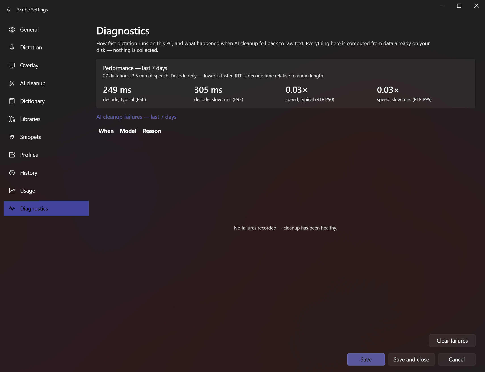

### Everything you said, on your disk
History keeps your recent dictations reviewable and copyable, with per-entry audio if you opt in.
Delete one entry or clear everything; it never leaves your PC either way.

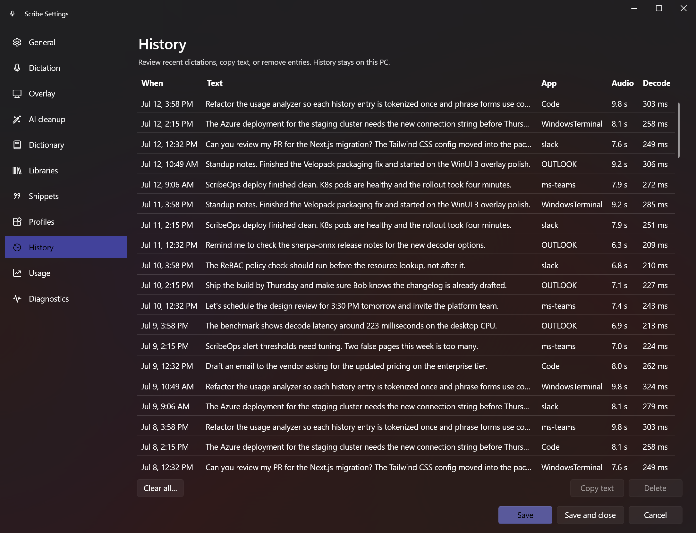

### See how dictation fits your work
The Usage section summarizes retained history across 7, 30 or 90 days, or all retained history.
Every metric uses the same selected period. It shows totals, active days, speech time, top apps,
a trend chart and recurring technical terms, and any recurring term your dictionary doesn't cover
yet gets an **Add** button that locks in its spelling on the spot. Opening or refreshing Usage
stays fully local. The optional AI insight button sends only aggregate totals and term labels
already in your dictionary. Terms mined from your dictations but not yet in your dictionary stay
on your machine, and it never sends transcript text, audio, application names or timestamps.

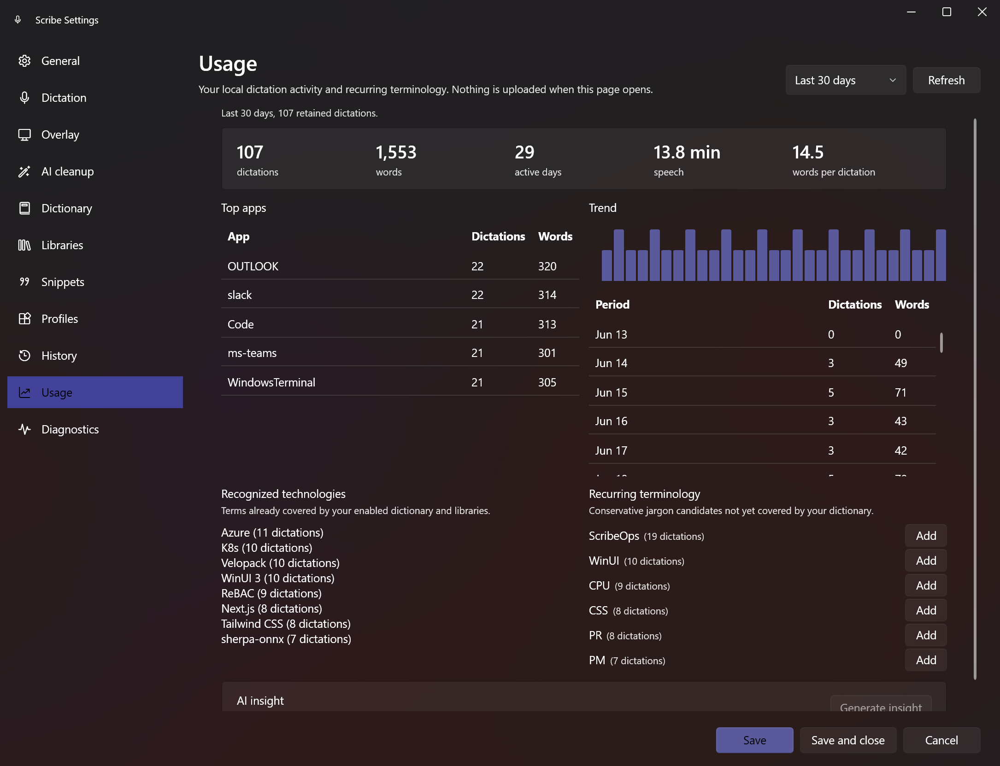

## 🚀 Getting started

**You'll need:** Windows 11 (x64). That's it. The speech model is bundled, so there's nothing else
to install.

1. Go to the **[Releases](../../releases/latest)** page.
2. Download **`Scribe-win-x64-Setup.exe`** (the installer). It installs Scribe and keeps it up to
   date automatically. Prefer not to install? Grab **`Scribe-win-x64-Portable.zip`** and run it from
   any folder instead.
3. Run the installer and launch Scribe. It appears in your **system tray**.

> **Windows security prompt:** Scribe releases are intentionally unsigned and do not require a
> publisher certificate. Windows may show an "Unknown publisher" or SmartScreen warning. Verify
> that the download came from this repository's Releases page before running it.

Then **hold Right Ctrl, say a sentence, and let go.** The text lands wherever your cursor is.
Right-click the tray icon for settings, one-click vocabulary learning, copying any of your last
five dictations, and pausing or quitting. If a dictation ever fails to insert, Scribe notifies you
and keeps the text ready to copy from the tray. Review history and local Usage from Settings.

## 🎛️ How it works

1. **Hold** your push-to-talk key. The glass pill shows it's listening, with a live level meter.
2. **Speak** naturally. Voice-activity detection trims the silence around your words.
3. **Release.** Scribe transcribes on your CPU, optionally polishes with AI (using the profile for
   the app you're in), applies your dictionary and snippets, and types the result into the focused
   app.

Everything is configurable from the tray: microphone, hotkey (hold or toggle), silence auto-stop,
the pill and where it appears, voice-activity detection, line-break handling, per-app profiles,
snippets, post-processing, start-with-Windows, and how text is inserted.

## 📚 The full feature catalog

**Dictation core**

| Feature | What it does |
|---|---|
| Push-to-talk | Separate AI-capable and optional dictation-only hotkeys, each hold or toggle on any key or two-key chord, with a capture UI that pauses dictation while you rebind |
| Silence auto-stop | Toggle-mode dictation ends itself when you go quiet |
| On-device speech recognition | Bundled NVIDIA Parakeet TDT 0.6b v3 handles ~25 European languages automatically; optional verified Moonshine Base and Tiny downloads provide fast English-only alternatives |
| Recording pill | A glass WinUI 3 overlay with a live level meter, placeable on any of 9 screen anchors with an on-screen preview |
| Smart text injection | Unicode or clipboard insertion with automatic fallback, and terminal-aware line-break flattening so newlines never fire Enter |
| Hotkey self-healing | Detects and repairs stuck modifiers and silently removed keyboard hooks, so push-to-talk keeps working across long sessions |

**Text quality**

| Feature | What it does |
|---|---|
| Personal dictionary | Spoken-form to replacement rules with whole-word matching, CSV import/export, and history-mined suggestions |
| Dictionary libraries | Six curated opt-in libraries (Azure, Microsoft 365, GitHub, data and AI, software development, modern developer stack) plus your own custom CSV libraries |
| Voice snippets | A spoken trigger phrase expands into a saved multi-line template |
| Per-app profiles | Writing style and line-break behavior switch automatically based on the focused app |
| AI cleanup | Optional polish through Foundry Local (fully offline), Microsoft Foundry (your az login), or any OpenAI-compatible endpoint; benchmark-validated prompts, your dictionary as a glossary, and raw-transcript fallback if the model misbehaves |
| Playground | Captures normal push-to-talk dictation, then shows raw recognition, final highlighted dictionary, library, and snippet replacements, and per-step timing |

**Insight and recovery**

| Feature | What it does |
|---|---|
| History | Retained dictations with optional audio, replayable and deletable, all local |
| Usage insights | Totals, speech time, active days, top apps, a trend chart, and recurring terminology with one-click add to dictionary |
| Dictation recovery | Your last five dictations stay copyable from the tray, and a failed insertion notifies you instead of losing text |
| Diagnostics | P50/P95 decode latency and real-time factor computed from your own history |
| AI usage insight | Opt-in, explicit, and aggregate-only: sends totals and dictionary term labels, never transcripts, audio, app names, or timestamps |

**App**

| Feature | What it does |
|---|---|
| Tray quick actions | Pause, AI cleanup on/off, learn from history, copy recent dictations, reopen the welcome tour |
| Auto-updates | Velopack keeps installs current with small delta packages |
| Offline by architecture | The dictation path needs no network, sends no telemetry, and keeps every stat on your disk |

## 📏 Performance, measured

Numbers below come from the checked-in benchmark reports, reproducible with the commands in each
document. Speech decode runs on CPU; your Diagnostics page shows the same percentiles for your
own hardware.

| Path | Measurement |
|---|---|
| Speech decode (typical desktop CPU) | **~223 ms** typical, real-time factor **~0.03×** (about 30× faster than the audio itself) |
| 10-second audio aggregation | 69 µs and 625 KB allocated (was 164 µs and 2.6 MB before the 0.2.1 hot-path work) |
| 48k-character cleanup chunking | 30 µs and 191 KB allocated (down 21% time, 49% allocation) |
| AI cleanup, fully offline (`phi-4` via Foundry Local) | ~1.6 s median added latency, best on-device quality grade |
| AI cleanup, cloud default (`gpt-5.4`) | ~1.8 s median added latency, grade B+ across the 46-model golden suite |

Details and methodology: the [model leaderboard](docs/model-leaderboard.md) (52 models against
Scribe's real cleanup pipeline with a golden-reference judge), the
[GPT-5.6 phonetic benchmark](docs/gpt56-phonetic-benchmark.md) (sound-alike transcript challenges
and prompt A/B results), and the [local performance benchmark](docs/local-performance-benchmark.md)
(BenchmarkDotNet, production code paths).

## 🔐 Your privacy, precisely

- **Audio never leaves your machine. Ever.** It is captured, transcribed in memory, and dropped.
- **Transcription is 100% local** (Parakeet via [sherpa-onnx](https://github.com/k2-fsa/sherpa-onnx) on CPU).
- **AI cleanup is optional and yours to control.** The on-device provider (Foundry Local) is fully
  offline. If you choose Azure or a custom endpoint, only the *transcribed text* (never audio) is
  sent to the server **you** configure, under **your** credentials.
- **Even the stats are local.** Performance and Usage are computed from history already on your disk.
  Usage AI insight runs only when you click it and sends bounded aggregate data without transcripts,
  audio, application names or timestamps.

## 🛠️ Building from source

**You'll need:** Windows 11 (x64) and the [.NET 10 SDK](https://dotnet.microsoft.com/download/dotnet/10.0).

```powershell
git clone https://github.com/ChrisMcKee1/scribe.git
cd scribe

# One-time: fetch the speech model (~670 MB). The installer ships with it bundled,
# but the model files are too large to live in git, so source builds download it once.
pwsh ./scripts/Download-Models.ps1

dotnet build Scribe.slnx -c Debug
dotnet run --project src/Scribe.App
```

Want to contribute? Everything else you need (project layout, code style, tests, the pull-request
workflow, the AI-cleanup eval harness, and how releases are packed) lives in
**[CONTRIBUTING.md](CONTRIBUTING.md)**.

## 📄 Licenses & attribution

Scribe is released under the **[MIT License](LICENSE)**.

It stands on the shoulders of excellent open work:

- **Parakeet TDT 0.6b v3**: © NVIDIA, [CC-BY-4.0](https://creativecommons.org/licenses/by/4.0/)
- **Moonshine**: © Useful Sensors, MIT
- **sherpa-onnx**: Apache-2.0 (Next-gen Kaldi / k2-fsa)
- **Silero VAD**: MIT

---

<div align="center">
<sub>Built for people who'd rather talk than type. 🎙️</sub>
</div>
