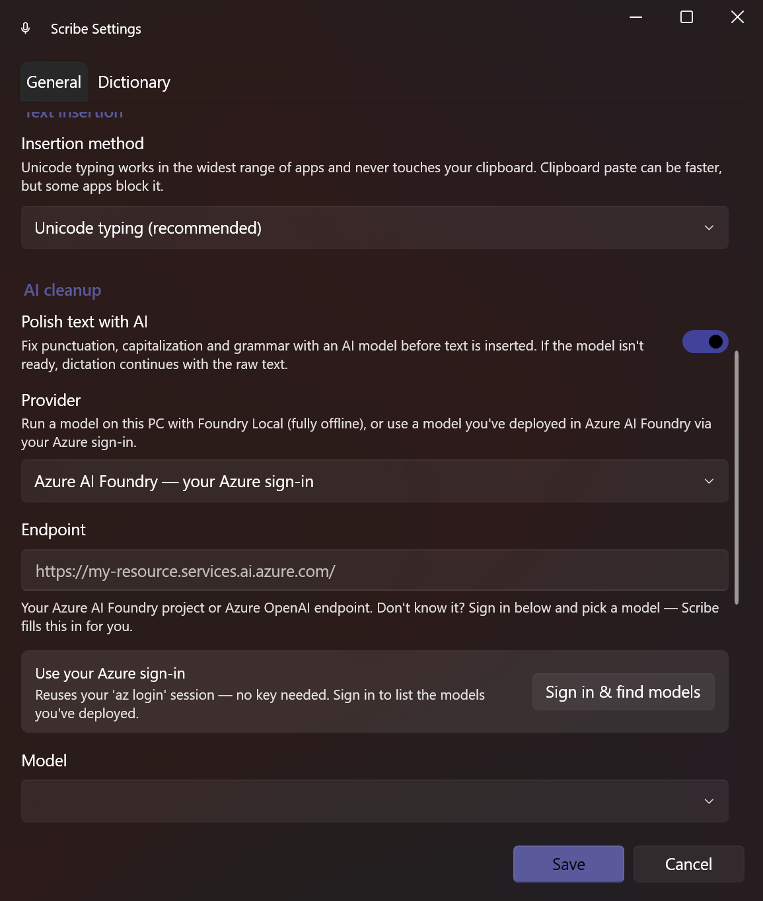

<div align="center">


# 🎙️ Scribe

**Private, offline voice dictation for Windows 11.**

Hold a key, speak, release — your words appear in whatever app you're using.
No cloud. No account. No audio ever leaves your PC.

</div>

---

Scribe is a lightweight tray app that turns your voice into text anywhere on Windows — your
editor, browser, chat, terminal, notes, email. It's built as a private, faster, more accurate
alternative to Windows Voice Typing, and it runs the speech model **entirely on your own machine**.

Speech is transcribed locally with **NVIDIA Parakeet TDT 0.6b v3** running on your CPU. The result
is punctuated, capitalized text dropped straight at your cursor — usually within a second of letting
go of the key.

## ✨ Why you'll like it

- **🔒 Truly private** — audio is captured, transcribed, and discarded on-device. Nothing is uploaded.
- **⚡ Push-to-talk** — hold **Right Ctrl** (or any key you choose), talk, release. That's the whole gesture.
- **🎯 Accurate out of the box** — a state-of-the-art model adds punctuation and capitalization for you.
- **🌍 Works everywhere** — types into any app via Unicode keystrokes; no clipboard hijacking required.
- **📖 Your vocabulary** — a built-in dictionary fixes brand names and jargon (`azure` → `Azure`, `dot net` → `.NET`).
- **🧹 Optional AI polish** — clean up grammar and structure with an on-device model, or your own Azure deployment.
- **🪶 Stays out of the way** — lives in the system tray with a tiny, optional recording overlay.

## 📸 A quick look

### Speak with a single key
Pick your microphone, choose a push-to-talk key, and toggle the behaviours you want. Hold to record,
release to insert.


### Polish your words with AI — on your PC
Turn on **AI cleanup** to have a small language model fix punctuation, capitalization and sentence
structure *before* the text is inserted. The default provider runs **fully offline** on your machine
through [Foundry Local](https://learn.microsoft.com/azure/ai-foundry/foundry-local/). If the model
isn't ready, dictation just continues with the raw transcript.


### …or bring your own Azure model
Prefer a model you've already deployed in **Azure AI Foundry**? Point Scribe at your endpoint and
deployment. It signs in with your existing `az login` (no key stored), or you can paste an API key.
Both classic Azure OpenAI resources and Foundry **project** endpoints are supported, with an optional
Tenant ID for multi-tenant accounts.



### Teach it your words
The dictionary replaces spoken words and phrases with the spelling you actually want. It ships with
sensible defaults for tech terms — add your own in seconds.


## 🚀 Getting started

> **Installers are on the way.** Prebuilt downloads with automatic updates will be published on the
> [Releases](../../releases) page. Until then, you can build and run Scribe from source — it takes a
> couple of minutes.

**You'll need:** Windows 11 (x64) and the [.NET 10 SDK](https://dotnet.microsoft.com/download/dotnet/10.0).

```powershell
# 1. Download the speech model (~670 MB) into ./models
pwsh ./scripts/Download-Models.ps1

# 2. Build
dotnet build Scribe.slnx -c Debug

# 3. Run — Scribe appears in your system tray
dotnet run --project src/Scribe.App
```

Then **hold Right Ctrl, say a sentence, and let go.** The text lands wherever your cursor is.
Right-click the tray icon for settings, history, and to pause or quit.

## 🎛️ How it works

1. **Hold** your push-to-talk key — a small overlay shows it's listening.
2. **Speak** naturally. Voice-activity detection trims the silence around your words.
3. **Release** — Scribe transcribes on your CPU, applies your dictionary, optionally polishes with AI,
   and types the result into the focused app.

Everything is configurable from the tray: microphone, hotkey (hold or toggle), the recording overlay,
voice-activity detection, post-processing, start-with-Windows, and how text is inserted.

## 🔐 Your privacy, precisely

- **Audio never leaves your machine — ever.** It is captured, transcribed in memory, and dropped.
- **Transcription is 100% local** (Parakeet via [sherpa-onnx](https://github.com/k2-fsa/sherpa-onnx) on CPU).
- **AI cleanup is optional and yours to control.** The on-device provider (Foundry Local) is fully
  offline. If you choose the Azure provider, only the *transcribed text* (never audio) is sent to the
  Azure resource **you** configure, under **your** sign-in.

## 🛠️ For contributors

Scribe is open source and contributions are welcome — see **[CONTRIBUTING.md](CONTRIBUTING.md)**.

```
Scribe.slnx
  src/Scribe.Core            services + domain: audio capture, transcription, VAD, post-processing,
                             text injection, hotkeys, persistence, settings, AI cleanup
  src/Scribe.App             WPF tray app: bootstrap + DI, settings window, recording overlay
  tests/Scribe.Core.Tests    unit tests (post-processor, dictionary, settings, engine smoke test)
  scripts/Download-Models.ps1  fetches the ASR + VAD models into ./models (gitignored)
  Directory.Packages.props     central NuGet version management
```

The optional AI cleanup is built on the **Microsoft Agent Framework** (`AIAgent`), so the on-device
(Foundry Local) and cloud (Azure AI Foundry) providers share one code path and are easy to extend.

### Security note

`Microsoft.Data.Sqlite` transitively references a SQLite build affected by **CVE-2025-6965**. Scribe
pins `SQLitePCLRaw.bundle_e_sqlite3` `3.0.3` directly to pull the patched native (`e_sqlite3` 3.50.3),
overriding the vulnerable transitive version.

## 📄 Licenses & attribution

Scribe is released under the **[MIT License](LICENSE)**.

It stands on the shoulders of excellent open work:

- **Parakeet TDT 0.6b v3** — © NVIDIA, [CC-BY-4.0](https://creativecommons.org/licenses/by/4.0/)
- **sherpa-onnx** — Apache-2.0 (Next-gen Kaldi / k2-fsa)
- **Silero VAD** — MIT

---

<div align="center">
<sub>Built for people who'd rather talk than type. 🎙️</sub>
</div>
