<div align="center">

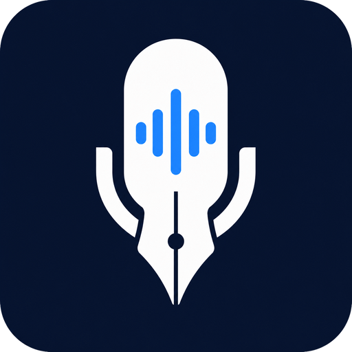

# Scribe AI

**Private, offline push-to-talk dictation for Windows 11.**

Hold a key, speak, and let go: punctuated text appears in whatever app you're using.<br />
Speech recognition runs on your PC, and your audio never leaves it.

<a href="https://apps.microsoft.com/detail/9N2P0SG059TJ?hl=en-us&amp;gl=US&amp;ocid=pdpshare">
  
</a>

Free · Signed by Microsoft · Updated by the Store · For Intel, AMD and Arm PCs


</div>

## Why Scribe

- **Private.** Your audio is recognized on your PC and then discarded. It is never uploaded, and it's kept
  only if you turn on audio history, on your PC, for at most 7 days and 250 MB. There's no Scribe account
  and no advertising.
- **Offline.** The speech model, NVIDIA Parakeet, comes with Scribe and recognizes about 25 European
  languages without being told which one you're speaking. Dictation needs no internet connection.
- **Fast.** With the speech model already loaded, a four-second generated sample was recognized in about
  0.12 seconds on our Ryzen 9 9900X test PC. Settings, Diagnostics shows the times on your PC.
- **Types where you work.** The text goes into the app you're using: email, chat, documents, browsers,
  code editors, command windows, and Remote Desktop and virtual machine windows too. Apps running as
  administrator are the exception: Windows doesn't let Scribe type into them.

## Get Scribe AI

**[Install Scribe AI from the Microsoft Store](https://apps.microsoft.com/detail/9N2P0SG059TJ?hl=en-us&gl=US&ocid=pdpshare).**
It's the version we recommend:

- **Signed by Microsoft,** so Windows installs it without a SmartScreen or "unknown publisher" warning.
- **Kept up to date by the Store,** so updates arrive without you downloading an installer.
- **The right build for your PC.** One listing covers Intel, AMD and Arm PCs, Copilot+ PCs included, and
  Windows downloads only the build your PC needs.

Then hold **Page Down**, wait for **Listening**, say a sentence, and let go. The text lands wherever your
cursor is. **Page Up** dictates without AI cleanup, for when you've turned AI cleanup on. Everything else
is in Settings, from the Scribe icon in the notification area.

- No Page Down key? Many laptops put it on Fn with the Down arrow. You can also choose any key, two keys
  together or a spare mouse button in Settings, Dictation.
- While Scribe runs, Page Down and Page Up on their own dictate instead of paging through documents (with
  Ctrl, Shift, Alt or Win held they work as usual). Presentation clickers send those same keys, so if you
  present, choose other keys.
- Installed Scribe before 0.4.4? Your shortcut stays as it was. Restore default shortcuts, in Settings,
  Dictation, switches to Page Down and Page Up.

**Can't use the Store?** Some work PCs block it. Download the installer from
[GitHub Releases](https://github.com/ChrisMcKee1/scribe/releases/latest) instead:
`Scribe-win-x64-Setup.exe` for Intel and AMD PCs or `Scribe-win-arm64-Setup.exe` for Arm PCs, with a
portable zip for each. These builds aren't signed, so Windows may warn you before it runs them, and they
update themselves from GitHub. Not sure which PC you have? Windows Settings, System, About shows it under
"System type".

## A quick tour

<p align="center">
  
</p>

**The recording indicator** shows when Scribe is listening. Its five bars rise and fall with
your voice; then it says **Recognizing speech** (or **Running AI cleanup**) and **Typed**, or what went
wrong and what to do next. Put it in any of nine places on screen, or turn it off.

<table>
<tr>
<td width="50%" valign="top">
<a href="docs/screenshots/dictation.png">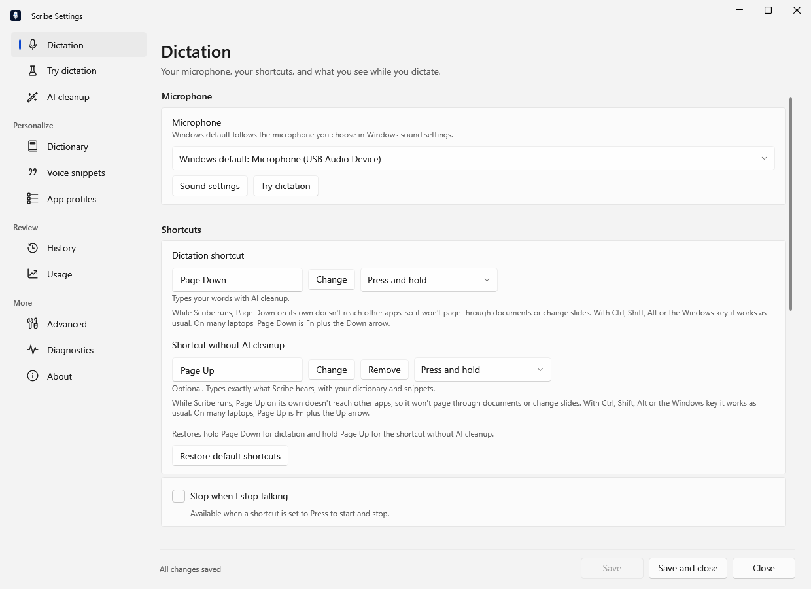</a><br />
<b>Dictation.</b> Pick a microphone or follow the Windows default, and set your two shortcuts: Press and hold, or Press to start and stop, with Stop when I stop talking.
</td>
<td width="50%" valign="top">
<a href="docs/screenshots/try-dictation.png">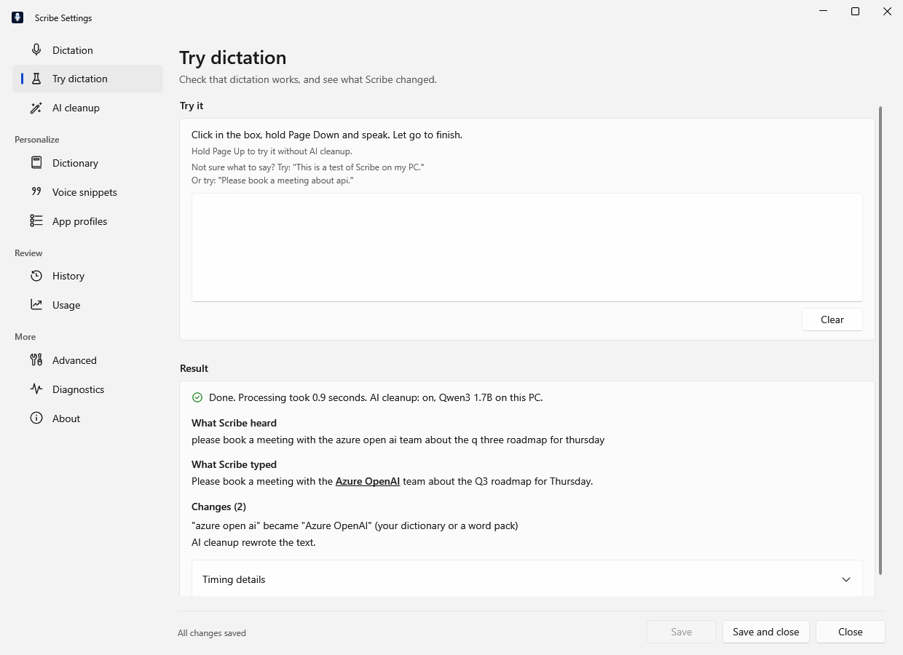</a><br />
<b>Try dictation.</b> Dictate once with your shortcut and see what Scribe heard, what it typed, every change it made and how long each step took.
</td>
</tr>
<tr>
<td width="50%" valign="top">
<a href="docs/screenshots/ai-cleanup.png">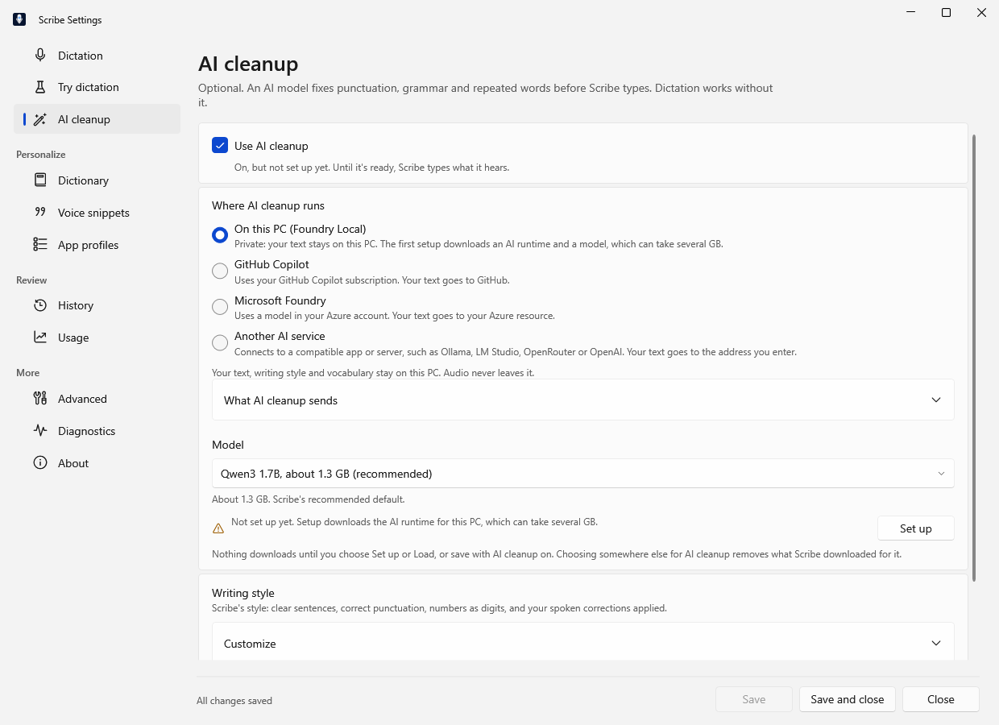</a><br />
<b>AI cleanup.</b> Optional. Fixes punctuation, drops fillers, keeps only what you meant when you correct yourself and writes lists as lists, on this PC with Scribe, Ollama or LM Studio, or with the AI service you choose. Until it's ready, Scribe types what it hears.
</td>
<td width="50%" valign="top">
<a href="docs/screenshots/dictionary.png">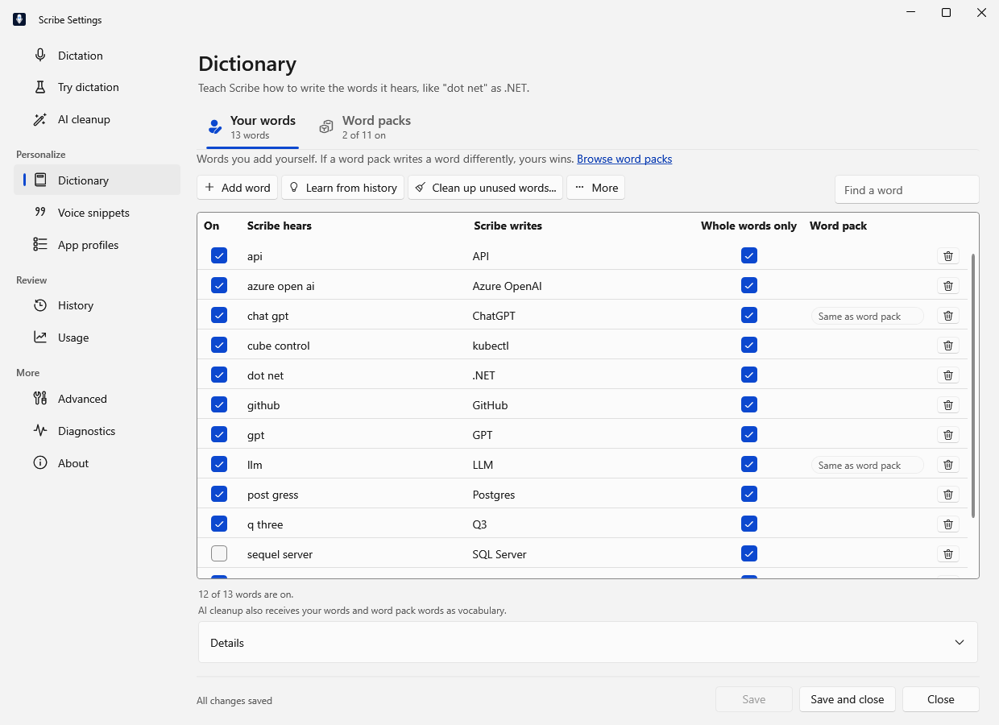</a><br />
<b>Your words.</b> Teach Scribe how to write the names, acronyms and jargon you use. Add word lets you enter several ways Scribe hears a word with one written spelling: choose Add another way for each phrase, then Add and Save. Edit opens the same form for one existing entry; you can still edit directly in the list. Spaces and commas are part of a phrase, not separators. Import a CSV, or let Learn from history suggest words you say often.
</td>
</tr>
<tr>
<td width="50%" valign="top">
<a href="docs/screenshots/word-packs.png">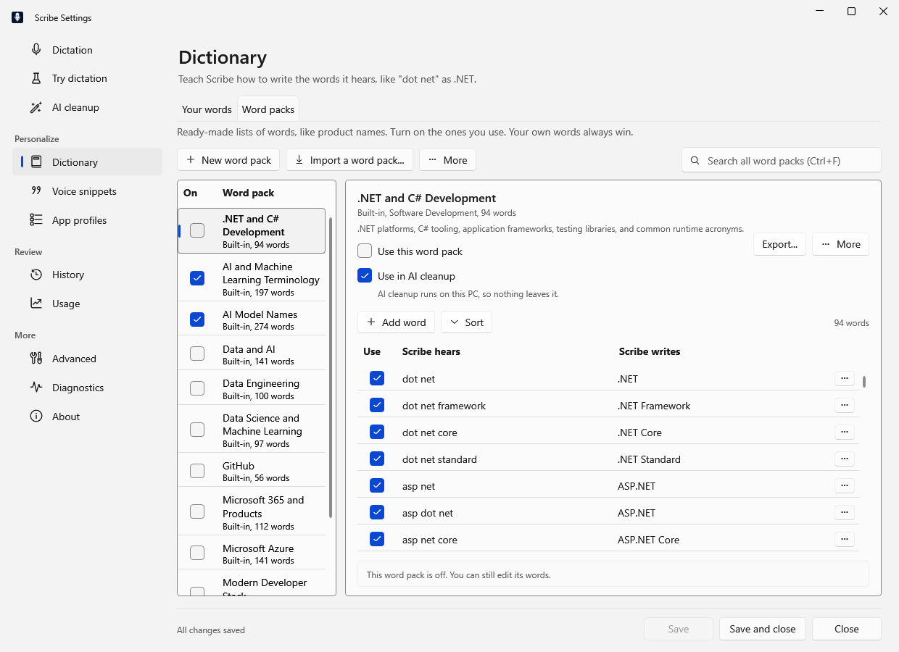</a><br />
<b>Word packs.</b> Eleven ready-made packs, from AI model names to Azure, GitHub and .NET. Make your own for your team's acronyms, product names or industry terms, share it as a CSV, or ask an AI assistant to build one. <a href="docs/word-packs.md">Learn more about word packs</a>.
</td>
<td width="50%" valign="top">
<a href="docs/screenshots/snippets.png">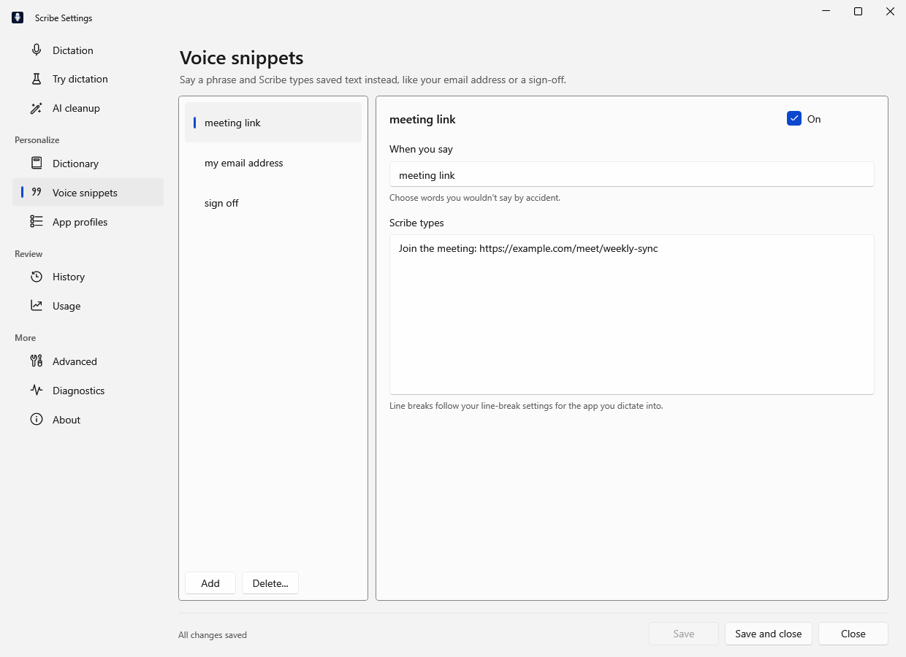</a><br />
<b>Voice snippets.</b> Say a short phrase and Scribe types the saved text, such as your email address, a sign-off or a meeting link.
</td>
</tr>
<tr>
<td width="50%" valign="top">
<a href="docs/screenshots/profiles.png">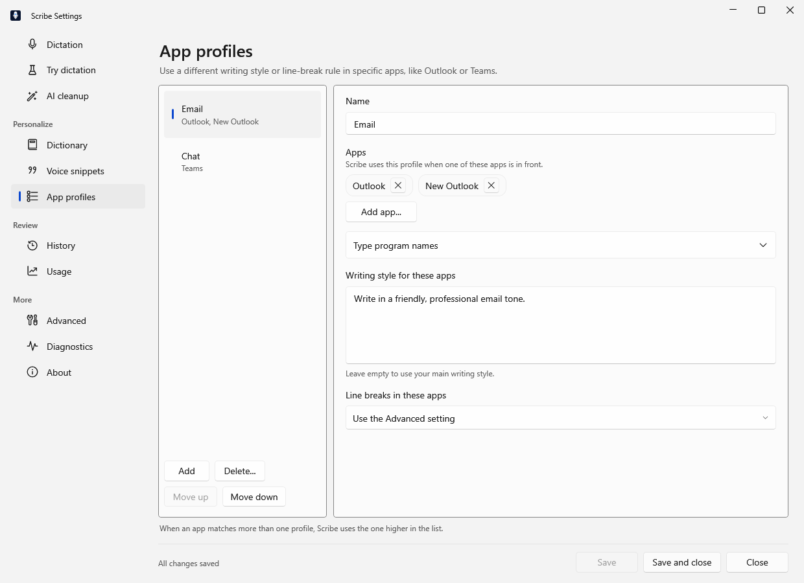</a><br />
<b>App profiles.</b> Give an app its own line breaks and, with AI cleanup, its own writing style. By default, Scribe turns line breaks into spaces in supported command windows, such as Windows Terminal.
</td>
<td width="50%" valign="top">
<a href="docs/screenshots/history.png">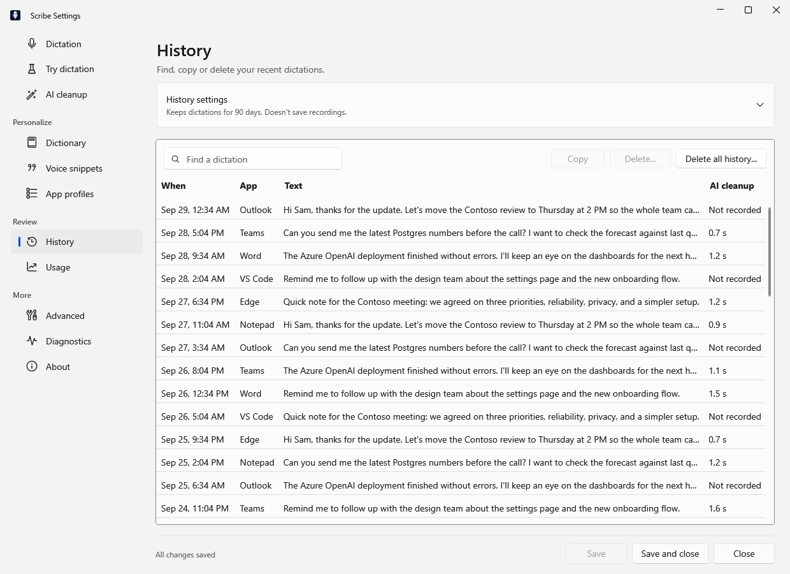</a><br />
<b>History.</b> Your dictations stay on your PC, for 90 days unless you choose otherwise, searchable and ready to copy. If one can't be typed, Scribe tells you and keeps it for you to copy from the tray.
</td>
</tr>
<tr>
<td width="50%" valign="top">
<a href="docs/screenshots/usage.png">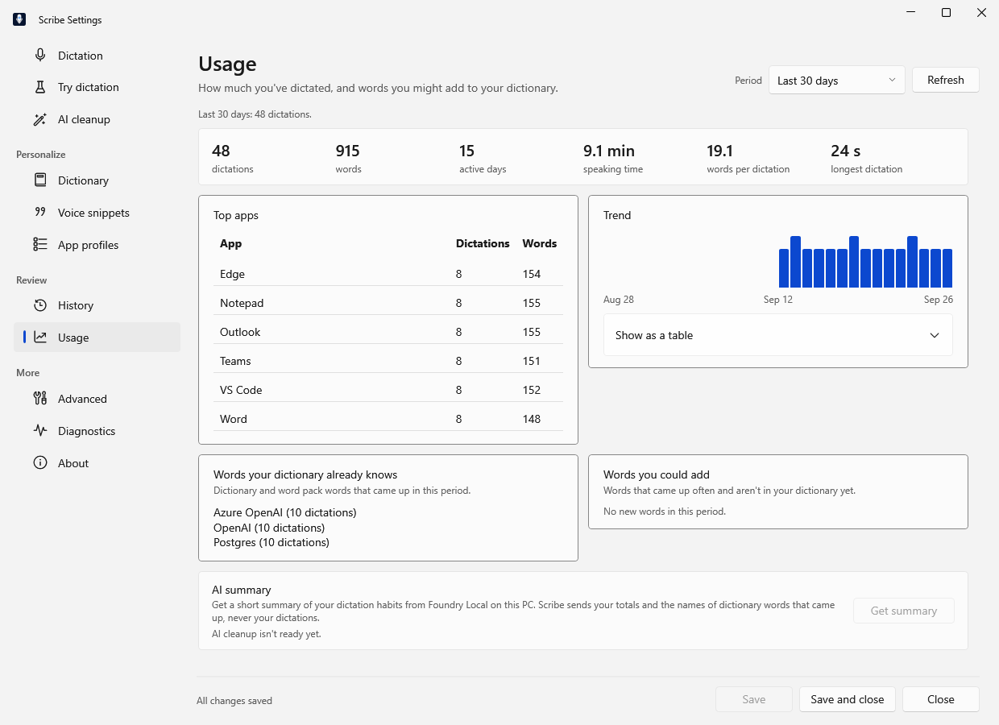</a><br />
<b>Usage.</b> How much you dictate, in which apps and on which days, with the dictionary words that came up and one click to add a new one. Worked out on your PC.
</td>
<td width="50%" valign="top">
<a href="docs/screenshots/diagnostics.png">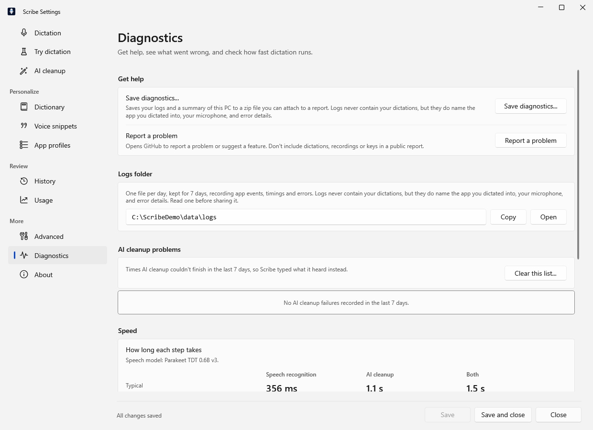</a><br />
<b>Diagnostics.</b> How long speech recognition and AI cleanup take on your PC, typically and for 19 in 20 dictations, and Save diagnostics for a bug report.
</td>
</tr>
</table>

And a few more things:

- **The tray.** Right-click the Scribe icon to open Settings, add a word from a recent dictation to your
  dictionary, copy any of your last five dictations, switch microphones, turn AI cleanup on or off, or
  pause dictation.
- **Mouse buttons.** Use the middle, Back or Forward button as a shortcut, or any other button through the
  key your mouse's software sends for it, such as F13. A button bound on its own stops doing its usual job
  in other apps unless you hold Ctrl, Shift, Alt or Win.
- **Remote Desktop and virtual machines.** In Remote Desktop, Azure Virtual Desktop, Windows 365, Hyper-V,
  VMware, VirtualBox and Citrix windows, Scribe moves its keyboard hook ahead of the remote client's so your
  shortcut reaches Scribe first, though a press in the moment right before or after a move can still reach
  the remote session. It types your text there in small batches, never pasting it, which adds about a
  quarter of a second to a 180-character dictation.
- **Your Windows settings.** Settings and the recording indicator follow your Windows text size, and the
  recording indicator follows your contrast theme and animation setting.

## AI cleanup, if you want it

AI cleanup is off until you turn it on. It fixes punctuation and capitalization, drops fillers such as
"um", keeps only what you meant when you correct yourself, and writes a list when you list things, before
the text is typed. You choose where it runs:

- **On this PC.** Fully offline. Choose how to run it:
  - **Let Scribe manage it,** with [Foundry Local](https://learn.microsoft.com/azure/ai-foundry/foundry-local/).
    Setting it up downloads the AI runtime for your PC and the model you pick, which can take several GB,
    and Scribe removes them if you move AI cleanup elsewhere.
  - **Ollama** or **LM Studio**, if you already have one. Scribe lists the models you downloaded in it, shows
    how much memory the model uses, and has the app free that memory after the time you set without a
    dictation, when you pause dictation, when AI cleanup stops using the model, and when you choose **Free
    memory**. That unloads it for any other app that uses the same model too. A small open model does the
    job: Gemma 4 E2B cleans a dictation in about a third of a second on a recent NVIDIA graphics card. If
    you set LM Studio to require an API key, choose **Another AI service** instead and enter its address
    and key there.
  - The first dictation after the model was freed waits for it to load, and the recording indicator says
    **Starting local model** while it does.
- **Microsoft Foundry,** with your Azure CLI sign-in or an app registration. [Set up a Foundry
  resource](docs/foundry-setup.md) or [use a service principal](docs/service-principal-setup.md). Scribe asks
  the model not to spend time reasoning, which cleans a dictation faster at the same quality. Turning
  off **Let Microsoft Foundry cache what Scribe sends** asks Microsoft Foundry not to use its prompt cache
  for new cleanup requests (see [Privacy](#privacy)).
- **GitHub Copilot,** with your own Copilot subscription, through the GitHub Copilot command-line tool.
- **Another AI service** that works like the OpenAI API, such as OpenRouter, OpenAI, or a server on another
  computer.

Settings doesn't recommend a model. The [local model benchmark](docs/local-model-benchmark.md) compares 39
open models across Foundry Local, Ollama and LM Studio, and the cloud models, on quality and time.

Test connection checks Microsoft Foundry or another AI service before you save. If the model isn't ready
or doesn't answer, Scribe types what it heard, and you can turn AI cleanup on or off from the tray at any
time.

## Scribe for Mac (preview)

This repository also holds a native macOS version of Scribe, in [`macos/`](macos/README.md). It's an early
preview for Apple Silicon Macs running macOS 13 or later, and you get it by building it from the source
here with one script: there's no signed download yet. It passes its builds and tests in CI on macOS 15
and 26, but it hasn't yet been run on a real Mac, so microphone access, the push-to-talk key and typing
into apps are still unproven there. It recognizes speech with Foundry Local, which you install with
Homebrew, and its default speech model is English only.

With the Xcode Command Line Tools installed:

```bash
brew install microsoft/foundrylocal/foundrylocal
./macos/Scribe/scripts/build-app.sh release
open macos/Scribe/dist/Scribe.app
```

[macos/README.md](macos/README.md) says what works today, what's missing and how to keep macOS from asking
for permissions again after each rebuild.

## Performance

Measured on one desktop PC (AMD Ryzen 9 9900X, Windows 11) with Release builds.

| Speech recognition, model already loaded | Time |
|---|---:|
| A four-second sentence | about 0.12 s |
| A 23-second passage | 0.64 s |

These speech times are examples from one Release scenario run on this PC with eight CPU threads and
generated speech. They time speech recognition after silence trimming, excluding model loading, AI
cleanup and typing. Results vary by PC and recording. To run it yourself:
`dotnet run --project tools/Scribe.AsrCheck -c Release -- --scenarios --quick`.

In the benchmark's tests, 0.5.1 uses far less memory than 0.5.0:

| Measured against 0.5.0 on the same PC | 0.5.0 | 0.5.1 |
|---|---:|---:|
| Managed allocation per synthetic 8-second capture, dictionary and history cycle | 9.19 MB | 1.18 MB |
| Full memory collections per 25 such cycles, after the first 25 | 7 to 11 | 0 |
| Private memory after collection in a synthetic idle-release test | 212.6 MiB | 54.1 MiB |
| Your words and every word pack applied to a short dictation | 0.45 ms | 0.22 ms |

These tests do not measure Scribe's total RAM use. The capture, dictionary and history test excludes
speech recognition, AI cleanup and typing. The idle-release test uses a synthetic heap, not the running
app.

The [local performance benchmark](docs/local-performance-benchmark.md) has the full results, the speech
samples included, and how to reproduce them.

## Privacy

- **Audio never leaves your PC.** It's recognized on your PC and discarded, unless you turn on audio
  history, which keeps recordings on your PC for at most 7 days and 250 MB.
- **Speech recognition is local:** Parakeet runs on your CPU through
  [sherpa-onnx](https://github.com/k2-fsa/sherpa-onnx).
- **AI cleanup is optional, and goes where you choose.** On this PC, with Scribe's own model, Ollama or LM
  Studio, everything stays on your PC. With Microsoft Foundry, GitHub Copilot or another AI service, each
  cleanup request sends the text Scribe recognized for that dictation (never audio), Scribe's cleanup
  instructions with your writing style, and the words from your dictionary plus the word packs you let AI
  cleanup use that the dictation appears to mention (up to 5,000 words or phrases, or 80 with the short
  instructions, which a server on your PC such as Ollama or LM Studio gets unless you choose otherwise). A
  word whose written text spans more than one line or runs past 100 characters, such as a signature, stays
  out. It goes only to the service you set up. With a server on your PC, starting a dictation also sends it
  the instructions with no dictated text and none of your vocabulary, so a model it unloaded while idle is
  ready by the time you stop talking.
- **Microsoft Foundry.** Scribe asks Microsoft Foundry not to store the response, though Microsoft's abuse
  monitoring can still keep a sample of flagged prompts and responses for review, as its
  [data privacy page](https://learn.microsoft.com/azure/foundry/responsible-ai/openai/data-privacy)
  explains. Its prompt cache may also keep temporary data derived from each request for at least 30
  minutes (up to 24 hours on some models). Turning off **Let Microsoft Foundry cache what Scribe sends**
  asks it not to use that cache for new cleanup requests. That works on GPT-5.6 and later models on
  Standard deployments; earlier models and provisioned deployments can't turn caching off, and Scribe
  can't clear what the cache already holds.
- **Usage and Diagnostics are worked out on your PC.** The Usage page's optional AI summary runs only when
  you ask for it, and sends usage totals and recurring vocabulary from your dictionary and the word packs
  you let AI cleanup use: never your dictations, audio, app names or dictation timestamps.

The [privacy policy](PRIVACY.md) lists what Scribe stores, what each request carries, and how to delete it.

## Build from source

You'll need Windows 11 and the [.NET 10 SDK](https://dotnet.microsoft.com/download/dotnet/10.0).

```powershell
git clone https://github.com/ChrisMcKee1/scribe.git
cd scribe
pwsh ./scripts/Download-Models.ps1   # one time: the speech model, about 670 MB
dotnet build Scribe.slnx -c Debug
dotnet run --project src/Scribe.App
```

The build targets the architecture you're on, and either kind of PC can build the other with
`-r win-x64` or `-r win-arm64`. [CONTRIBUTING.md](CONTRIBUTING.md) covers the project layout, tests and
pull requests, and the [Microsoft Store submission checklist](docs/microsoft-store-submission.md) covers
Store releases.

Questions, ideas or bugs? Open a [GitHub issue](https://github.com/ChrisMcKee1/scribe/issues/new), and
please leave dictations, audio, keys and other private details out of it. If Scribe earns a place in your
day, a star on this repository helps other people find it.

## Licenses & attribution

Scribe is released under the [MIT License](LICENSE). It builds on excellent open work:

- **Parakeet TDT 0.6b v3**: © NVIDIA, [CC-BY-4.0](https://creativecommons.org/licenses/by/4.0/)
- **Moonshine**: © Useful Sensors, MIT
- **sherpa-onnx**: Apache-2.0 (Next-gen Kaldi / k2-fsa), with **ONNX Runtime**: © Microsoft, MIT
- **Silero VAD**: MIT
- **Microsoft Agent Framework** (`Microsoft.Agents.AI`, `Microsoft.Agents.AI.GitHub.Copilot`): © Microsoft, MIT
- **GitHub Copilot SDK** (`GitHub.Copilot.SDK`): © GitHub, MIT
- **Also:** WPF UI, NAudio, H.NotifyIcon, Velopack, the OpenAI package for .NET, the Foundry Local SDK,
  Microsoft.Extensions.AI, Microsoft.Data.Sqlite and the Azure SDK for .NET (all MIT); SQLitePCLRaw and
  OpenTelemetry .NET (Apache-2.0); SQLite (public domain); and the Windows App SDK (Microsoft Software
  License Terms).
